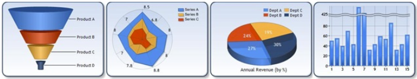

# winforms-datavisualization .Net FrameWork 4.8
 Rought (retro) porting to .Net FrameWork 4.8 of [dotnet/winforms-datavisualization project](https://github.com/dotnet/winforms-datavisualization) including Web and Win Sample solutions as well. 
 
# Data Visualization
This repository contains partial source code of the `System.Windows.Forms.DataVisualization` namespace that provides charting for WinForms. 
Microsoft ported and open sourced those components to enable charting features for WinForms applications that are developed on .NET Core 3.

I've made the porting back to .Net FrameWork 4.8:
- updating references
- updating project files
- - ...

Application Running FW 4.8:


## References
The [original port](https://github.com/dotnet/winforms-datavisualization) to .Net Core 3.0 used very old and still in Beta/Preview references:


and moving away from them was a bit tricky, now they're all actualized:
```xml
  <ItemGroup>
    <Reference Include="System" />
    <Reference Include="System.Design" />
    <Reference Include="System.Drawing" />
    <Reference Include="System.Drawing.Design" />
    <Reference Include="System.Windows.Forms" />
    <Reference Include="System.Data" />
    <Reference Include="System.Xml" />
  </ItemGroup>
  ```
  


## CSProj
The CSProj files were also modified according to the new target / Platform (Windows):

Original (Relavant Portion):
```xml
<Project Sdk="Microsoft.NET.Sdk.WindowsDesktop">
  <PropertyGroup>
    <TargetFramework>netcoreapp3.0</TargetFramework>
    <AssemblyName>System.Windows.Forms.DataVisualization</AssemblyName>
    <AllowUnsafeBlocks>true</AllowUnsafeBlocks>
    <CLSCompliant>false</CLSCompliant>
    <NoWarn>$(NoWarn);618</NoWarn>
    <DefineConstants>$(DefineConstants);WINFORMS_CONTROL</DefineConstants>
    <!-- <Win32Manifest>Resources\System\Windows\Forms\XPThemes.manifest</Win32Manifest> -->
  </PropertyGroup>
  ```
  
Ported Version (Relavant Portion):
```xml
<Project ToolsVersion="15.0" xmlns="http://schemas.microsoft.com/developer/msbuild/2003">
  <Import Project="$(MSBuildExtensionsPath)\$(MSBuildToolsVersion)\Microsoft.Common.props" Condition="Exists('$(MSBuildExtensionsPath)\$(MSBuildToolsVersion)\Microsoft.Common.props')" />
  <PropertyGroup>
    <Configuration Condition=" '$(Configuration)' == '' ">Debug</Configuration>
    <Platform Condition=" '$(Platform)' == '' ">AnyCPU</Platform>
    <ProjectGuid>{1944C3B0-C641-419D-AE92-A96DD39B7C4F}</ProjectGuid>
    <OutputType>Library</OutputType>
    <RootNamespace>System.Windows.Forms.DataVisualization</RootNamespace>
    <AssemblyName>System.Windows.Forms.DataVisualization</AssemblyName>
    <TargetFrameworkVersion>v4.8</TargetFrameworkVersion>
    <FileAlignment>512</FileAlignment>
    <AutoGenerateBindingRedirects>true</AutoGenerateBindingRedirects>
    <Deterministic>true</Deterministic>
    <TargetFrameworkProfile />
  </PropertyGroup>
```

    
## Getting started with Chart Controls
The best way to learn about Chart Controls is by looking at the [Win Sample solution](https://github.com/AngeloCresta/winforms-datavisualization-net4.8/tree/main/WinSamples) or [Web Sample solution](https://github.com/AngeloCresta/winforms-datavisualization-net4.8/tree/main/WebSamples)  where via interactive experience with the app you can learn about every chart type and every major feature. While modifying the control parameters and instantly seeing how that affects the look of the control, you can also get the generated C# or Visual Basic code to use in your apps.



With the sample project you can see every property and parameters in action:

Web Sample:


Win Sample:


and then copy the relavant portion of the code (C# or VB.Net):

Web:


Win:


## History
25th May: Initial Porting to .Net FrameWork 4.8

Hope this helps!
